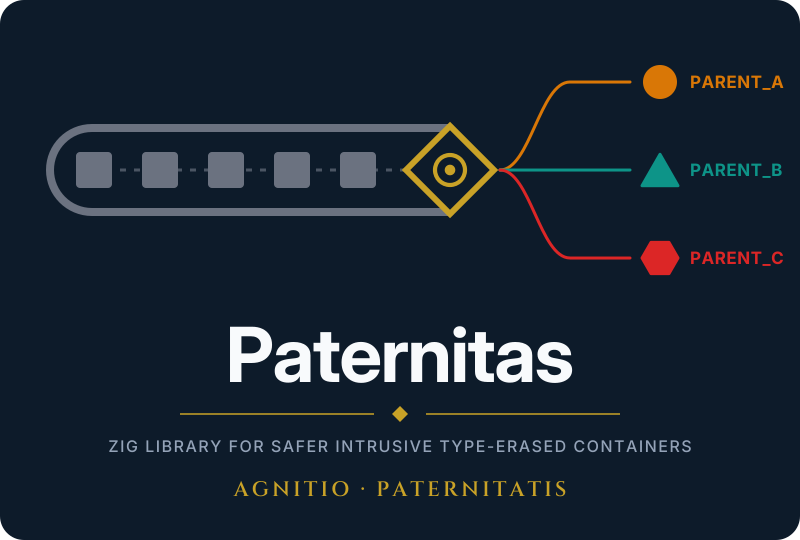

[](https://opensource.org/licenses/MIT)
[](https://github.com/g41797/paternitas/actions/workflows/linux.yml)
[](https://github.com/g41797/paternitas/actions/workflows/windows.yml)
[](https://github.com/g41797/paternitas/actions/workflows/mac.yml)
[](https://github.com/g41797/paternitas/actions/workflows/docs.yml)

---

Paternitas makes Zig's intrusive, type-erased lists safer.

---


You probably do not need it for your first linked list.

You may want it when the list becomes part of a real system.

A mailbox grows.

A scheduler gets more job types.

A dispatcher starts passing different structs through the same list.

Then you pop a `Node`.

And you have a small problem:

**What struct is this Node inside?**

The std list does not know.

---

Paternitas gives you a cheap answer.

---

## Three words first

**Intrusive.**

- The link lives inside your struct.
- The list keeps a pointer to that link.
- It never copies your struct.

**Type-erased.**

- The list sees only the link, a `Node`.
- It does not know the struct type around it.

**Parent.**

- The struct that contains the Node.
- Getting the Parent back from a Node is `@fieldParentPtr`.

---

## The problem in one example

Suppose one list contains `Message` and `Job`.

```zig
const Message = struct {
    text: []const u8,
    node: std.DoublyLinkedList.Node = .{},
};

const Job = struct {
    id: u32,
    node: std.DoublyLinkedList.Node = .{},
};

list.append(&message.node);
list.append(&job.node);
```

Later:

```zig
const node = list.popFirst().?;

const job: *Job = @fieldParentPtr("node", node);
```

The code compiles.

The code runs.

But maybe `node` belongs to `Message`.

Now `job` points at a `Message`.

That is the bad part of intrusive, type-erased code:

- the container forgot the struct type,
- `@fieldParentPtr` trusts your answer,
- a wrong answer is still a pointer,
- the bug may show up much later.

Paternitas puts a type id next to the Node.

Now:

```zig
if (TypedMessage.parentFromNode(node)) |message| {
    // It really is a Message.
}
```

Wrong type:

```text
null
```

Or, when the wrong type is a programmer error:

```zig
TypedMessage.mustParentFromNode(node);
```

That gives a panic with the expected and actual type.

No new container.

No allocation.

No lock.

Your std list stays your std list.

---

## Do I need it?

Probably not for every intrusive list.

If your list has only `Job`, and everybody knows it contains `Job`, use the plain std list.

Use Paternitas when:

- one list deliberately mixes struct types,
- the code handling the list should not know every application type,
- the Node comes from somewhere else,
- you do not want to trust every `@fieldParentPtr` call by hand,
- a bad cast would turn into a very long debugging session.

The last one is a perfectly respectable reason.

Typical examples:

- a mailbox with different message types,
- a scheduler with different job types,
- a dispatcher,
- a generic intrusive container,
- infrastructure that passes application structs without knowing their concrete type.

Paternitas is for the moment when "I know what this is" becomes "I hope I know what this is".

---

## Move your code to Paternitas

The change is small and boring.

The list itself does not change.

For each struct that can enter the list:

### 1. Replace the Node

Before:

```zig
const Message = struct {
    text: []const u8,
    node: std.DoublyLinkedList.Node = .{},
};
```

After:

```zig
const Message = struct {
    text: []const u8,
    tnode: paternitas.DoublyTypedNode = .{},
};
```

### 2. Add the helper

Right after the struct:

```zig
const TypedMessage = paternitas.Typed(Message);
```

### 3. Mark each new value

```zig
var message: Message = .{ .text = "hello" };
TypedMessage.setTypeId(&message);
```

### 4. Give the Node to the list

Before:

```zig
list.append(&message.node);
```

After:

```zig
list.append(TypedMessage.node(&message));
```

### 5. Stop guessing the type yourself

Before:

```zig
const message: *Message = @fieldParentPtr("node", node);
```

After, when several types are possible:

```zig
if (TypedMessage.parentFromNode(node)) |message| {
    std.debug.print("{s}\n", .{message.text});
}
```

After, when the type must be `Message`:

```zig
const message: *Message = TypedMessage.mustParentFromNode(node);
```

That is the normal Paternitas usage.

---

## The four calls

You will use these most of the time.

| Call                                | What it does                                     |
| ----------------------------------- | ------------------------------------------------ |
| `paternitas.Typed(Message)`         | makes the helper for `Message`                   |
| `TypedMessage.setTypeId(&message)`  | marks the value as a `Message`                   |
| `TypedMessage.node(&message)`       | gives the Node to the std list                   |
| `TypedMessage.parentFromNode(node)` | checks the Node and gives you `*Message` or null |

There is also:

```zig
TypedMessage.mustParentFromNode(node)
```

Use it when another type would mean a bug.

It panics instead of returning `null`.

---

## Singly or doubly linked?

Use the matching typed Node.

For `std.SinglyLinkedList`:

```zig
tnode: paternitas.SinglyTypedNode = .{},
```

For `std.DoublyLinkedList`:

```zig
tnode: paternitas.DoublyTypedNode = .{},
```

The field name does not matter.

`node`, `tnode`, `link`. All are fine.

Paternitas finds the field by its type.

One struct, one TypedNode.

A second one is a compile error.

---

## One important rule

Call `setTypeId` after creating the struct.

```zig
var message: Message = .{ .text = "hello" };
TypedMessage.setTypeId(&message);
```

Do it again after a whole-struct reset:

```zig
message = .{ .text = "again" };
TypedMessage.setTypeId(&message);
```

A whole-struct write replaces the type id too.

Changing one field is fine:

```zig
message.text = "again";
```

The type id stays there.

This is easy to miss.

The compiler cannot find this particular mistake for you.

---

## Why not just use a tagged union?

Sometimes a tagged union is exactly right.

Sometimes it is not.

A generic list has a useful property:

**the list does not need to know your application types.**

With a union:

```zig
union(enum) {
    message: Message,
    job: Job,
    ...
}
```

adding a new type means changing the union.

Code that switches over the union may need changes too.

With an intrusive, type-erased list:

- the list stays the same,
- the queue stays the same,
- the scheduler stays the same,
- the dispatcher stays the same,
- new application structs can join the system.

You pay for that flexibility by losing the type at the container boundary.

Paternitas puts the type back where you need it.

---

## Why intrusive lists at all?

Because sometimes copying the struct is the wrong thing to do.

An intrusive list keeps the link inside your struct.

```text
Message
+----------------------+
| text                 |
| tnode                |
|   node  <--- list    |
|   type id            |
+----------------------+
```

The list does not copy your `Message`.

The list does not allocate a second `Message`.

The struct stays at its own address.

That matters when:

- another piece of code has a pointer to the struct,
- the struct contains a mutex,
- the struct is large,
- moving the struct would be inconvenient or wrong,
- you want to move an item between lists without copying it.

Paternitas does not change any of this.

It only makes the type recovery safer.

---

## Several types in one list

This is where Paternitas is most useful.

Copy it and run it. It prints:

```text
Hello Message: hi
Hello Job: 42
```

```zig
const std = @import("std");
const paternitas = @import("paternitas");

const Message = struct {
    text: []const u8,
    tnode: paternitas.DoublyTypedNode = .{},
};
const TypedMessage = paternitas.Typed(Message);

const Job = struct {
    id: u32,
    tnode: paternitas.DoublyTypedNode = .{},
};
const TypedJob = paternitas.Typed(Job);

pub fn main() void {
    var message: Message = .{ .text = "hi" };
    TypedMessage.setTypeId(&message);
    var job: Job = .{ .id = 42 };
    TypedJob.setTypeId(&job);

    var list: std.DoublyLinkedList = .{};
    list.append(TypedMessage.node(&message));
    list.append(TypedJob.node(&job));

    while (list.popFirst()) |node| {
        if (TypedMessage.parentFromNode(node)) |m| {
            std.debug.print("Hello Message: {s}\n", .{m.text});
        } else if (TypedJob.parentFromNode(node)) |j| {
            std.debug.print("Hello Job: {d}\n", .{j.id});
        }
    }
}
```

The loop knows the types it handles.

The list does not.

That separation is useful in larger systems.

---

## Passing structs through other type-erased code

Not everything is a linked list.

Maybe a generic queue carries different structs.

Maybe a map stores callbacks and contexts.

Maybe a union field needs to carry a struct without copying it.

Use `AnyParent`.

```zig
const any = TypedMessage.toAny(&message);
```

It contains:

- the address,
- the type id.

It does not contain a copy of `Message`.

Later:

```zig
if (TypedMessage.fromAny(any)) |message| {
    handleMessage(message);
}
```

The type is checked when you turn it back into a `Message`.

The receiver does not even have to know the type.

Keep one handler per type in a map, keyed by the type id:

```zig
const Handler = *const fn (parent: *anyopaque) void;

var handlers: std.AutoHashMap(paternitas.TypeId, Handler) = .init(allocator);
try handlers.put(TypedMessage.typeId(), onMessage);
try handlers.put(TypedJob.typeId(), onJob);

// The dispatch never names a type.
if (handlers.get(any.type_id)) |h| h(any.ptr);
```

The handler casts `ptr` to its own type.

The map matched the type id, so the type is right.

The struct itself must still be alive.

---

## Writing your own container?

Most users can stop here.

If you write a generic container, Paternitas also exposes:

- `Anchor`
- `TypeId`
- `container`

`Anchor` is a one-word handle to a Parent.

It is useful when the container needs a stable pointer but does not know the concrete struct type.

`container` contains support for container authors.

Application code normally does not need it.

---

## What Paternitas does not do

Paternitas is not a list library.

It does not provide:

- a list,
- a queue,
- a pool,
- an allocator,
- a lock.

You keep using the containers you already use.

Paternitas only helps with one dangerous operation:

```text
erased Node
    |
    | "I think this is a Message"
    v
*Message
```

It checks that answer first.

It does not check lifetime.

If the struct is gone, Paternitas cannot bring it back.

It also does not make shared access safe.

Lock your shared list yourself.

---

## Type ids have a boundary

A Paternitas type id is for one running program.

Do not:

- save it to disk,
- send it over the network,
- use it as a process-to-process type number.

Shared libraries have their own type ids too.

So a type marked in one shared library does not automatically match the same type in the main program.

---

## A quick comparison

|                           | Plain std intrusive list  | With Paternitas                     |
| ------------------------- | ------------------------- | ----------------------------------- |
| allocation for the link   | none                      | none                                |
| copy of your struct       | no                        | no                                  |
| list type                 | unchanged                 | unchanged                           |
| type erased               | yes                       | yes                                 |
| wrong type                | a bad pointer             | null, or a panic naming both types  |
| several types in one list | possible                  | possible, with checks               |
| lifetime checking         | no                        | no                                  |
| locking                   | no                        | no                                  |

The important row is the bad one:

**wrong type.**

That is what Paternitas is here to fix.

---

## Install

Fetch the package:

```sh
zig fetch --save git+https://github.com/g41797/paternitas
```

Add it to `build.zig`:

```zig
const paternitas = b.dependency("paternitas", .{
    .target = target,
    .optimize = optimize,
});

exe.root_module.addImport("paternitas", paternitas.module("paternitas"));
```

Then:

```zig
const paternitas = @import("paternitas");
```

Requirements:

- Zig 0.16.0
- `std` only

API documentation:

https://g41797.github.io/paternitas/apidocs/

---

## Why the name?

*Paternitas* is Latin for "fatherhood".

A list gives you an unknown Node.

Paternitas helps you establish its Parent.

That is the idea.

> The Node may be unknown.
>
> Paternitas establishes its parentage.

---

## Where it came from

The trigger was the Ziggit post
[New LinkedList API footgun](https://ziggit.dev/t/new-linkedlist-api-footgun/10853).

Paternitas grew out of Matryoshka, a toolkit for background processes.

The same problem appeared in each version:

- [matryoshka-otk](https://github.com/g41797/matryoshka-otk), in Odin: a hand-made tag.
- [matryoshka-3tk](https://github.com/g41797/matryoshka-3tk), in C3: its own `typeid`.
- [matryoshka-ztk](https://github.com/g41797/matryoshka-ztk), in Zig: comptime helpers.

The useful part turned out to be small enough to use by itself.

So Paternitas was extracted from matryoshka-ztk.

Matryoshka can use it as a package.

Your project can too.

---

## Credits

- [Karl Seguin](https://github.com/karlseguin), for the article that introduced
  [Zig's new LinkedList API](https://www.openmymind.net/Zigs-New-LinkedList-API/).
- The Zig standard library, for giving us the intrusive list in the first place.
